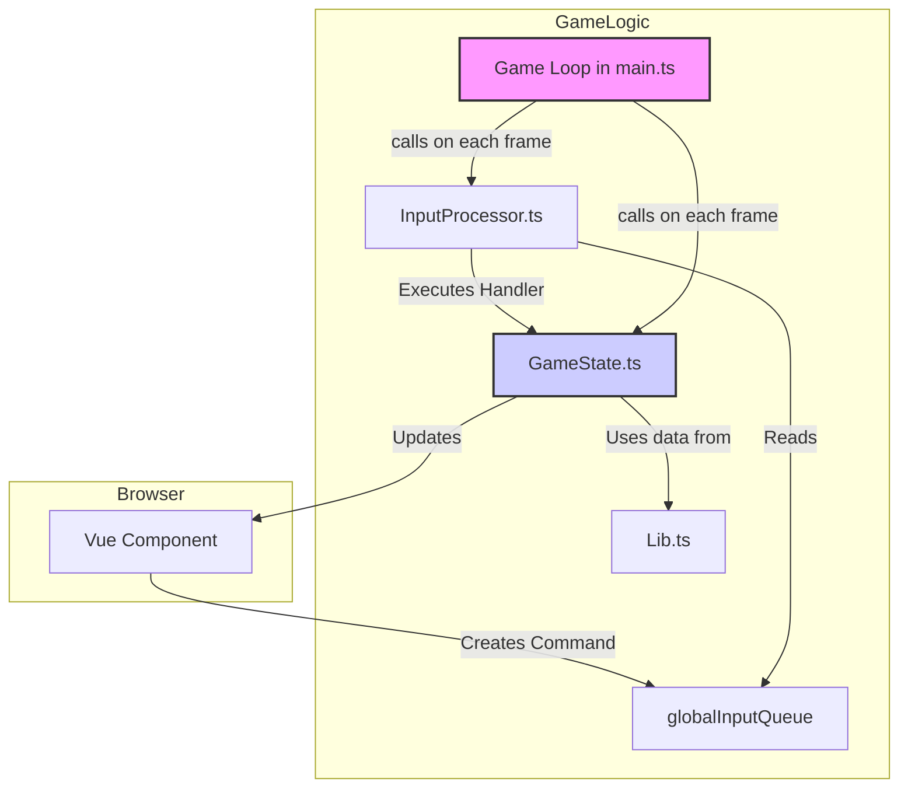

This is a web game which is based on a real life location of Almaty.

## Modus Operandi

The project follows a structured architecture that separates core game logic from the user interface (Vue components). This is inspired by designs used in other web-based games and ensures that the game's state and rules are managed independently of the rendering layer.

### Core Concepts

1.  **`GameState` (src/logic/GameState.ts)**: This is the central hub for all game-related data. It holds the game time, entity lists (like characters, items, etc., in the future), and a special `uiState` object. It has an `update()` method that is called on every game tick to advance the game's logic.

2.  **Game Loop (src/main.ts)**: The game runs on a continuous loop initiated by `requestAnimationFrame`. On each "tick" of the loop, it performs two key actions:
  *   It processes any pending player inputs.
  *   It calls `GameState.update()` to move the game simulation forward.

3.  **Input Processing (src/logic/input/)**: Player actions (like clicking a button) don't directly modify the `GameState`. Instead, they create a **command** object and push it into a global queue (`globalInputQueue` in `GameState.ts`).
  *   `InputProcessor.ts` reads this queue at the start of each game tick.
  *   For each command, it finds the corresponding handler function and executes it.
  *   This ensures that all state modifications happen in a predictable order within the game loop.

4.  **The `Lib` System (src/logic/lib/)**: This is a data library responsible for loading and storing all the static definitions for game entities (e.g., item types, character stats, event definitions). In a full game, it would load this data from files (like JSON or TS files), providing a central, read-only source of truth for game content.

5.  **Reactive UI (`uiState`)**: The `GameState` contains a special `uiState` object created with Vue's `reactive()` function. The core game logic can modify properties on `uiState`. Because it's reactive, any Vue components that are displaying those properties will automatically update without needing to be explicitly told. This creates a one-way data flow: `GameState` -> `UI`.

### How It Fits Together

Tech stack:
git
vue
typescript
maplibre-gl