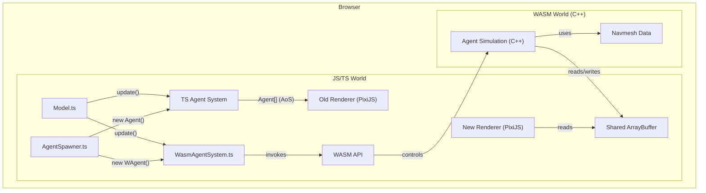

# High-Performance Agent Simulation with WebAssembly

## 1. Introduction

This document outlines the design and implementation plan for porting the agent simulation logic from TypeScript to a C++ WebAssembly (WASM) module. The primary goal is to significantly improve performance and memory efficiency, enabling the simulation of thousands of agents in real-time.

The new WASM-based system will exist alongside the original TypeScript implementation for testing and comparison. It will use a Structure of Arrays (SoA) data layout and shared memory to allow the JavaScript rendering layer to display the agents simulated in WASM with minimal overhead.

## 2. Architecture Overview

The core of this new architecture is a dual-system approach. The existing `Agent` class and its related TS logic will remain untouched. A new, parallel system centered around a `WAgent` (WASM Agent) class will be introduced. Both systems can run concurrently, but they will be independent and their agents will not interact with each other.

-   **TypeScript/JavaScript World:** Remains responsible for the main application loop (`Model.ts`), user interface, rendering (PixiJS), and high-level commands like spawning agents. A new `WasmAgentSystem.ts` module will serve as the bridge to the C++ world.
-   **WebAssembly World (C++):** Will handle all the computationally intensive tasks of agent simulation: navigation, movement physics, pathfinding, and collision detection. It will operate directly on a memory buffer shared with JavaScript.



## 3. Data Structures & Memory Model

### 3.1. Navmesh Data

The static navmesh data will be passed from JavaScript to the WASM module on initialization.

1.  The raw navmesh data (e.g., from `navmesh.txt`) will be loaded in JavaScript as an `ArrayBuffer`.
2.  This `ArrayBuffer` will be transferred to the WASM module.
3.  The C++ code will parse this binary data and build its own efficient representation of the navmesh (vertices, triangles).
4.  The spatial index (`NavTriIndex`) will be reconstructed within the WASM module, as the C++ implementation will be significantly faster at this task. The existing NavTriIndex.ts already uses typed arrays (`Uint32Array`, `Int32Array`) which map directly to shared memory, allowing both JS and WASM to access the same spatial index data.

### 3.2. Agent SoA Layout

To maximize cache efficiency, `WAgent` data will be organized in a Structure of Arrays (SoA) layout. All arrays will be part of a single, contiguous `SharedArrayBuffer` allocated by JavaScript and passed to the WASM module.

The buffer will be structured as follows:

```
[
  // Position (vec2)
  x_0, y_0, x_1, y_1, ..., x_N, y_N,
  // Velocity (vec2)
  vx_0, vy_0, vx_1, vy_1, ..., vx_N, vy_N,
  // Look (vec2)
  lx_0, ly_0, lx_1, ly_1, ..., l_N, l_N,
  // State (enum)
  state_0, state_1, ..., state_N,
  ... other agent properties ...
]
```

-   **Data Types:** All numerical data will be stored in `Float32Array` or `Int32Array` views of the shared buffer.
-   **Display Strings:** The `display` string will stay purely on the js side as it is used for rendering.
-   **Dynamic Data:** Agent-specific data that is dynamic in size, like the `corridor` path, will be managed entirely within the WASM module's private heap. It does not need to be shared with js.

## 4. WASM Module API

The C++ code will be compiled with Emscripten and will expose a clear API to JavaScript.

### 4.1. Initialization

-   `init(sharedBuffer, navmeshBuffer)`: Initializes the WASM module. Takes the shared memory for agents and the raw navmesh data. Internally, it sets up its data views and builds the navmesh.

### 4.2. Agent Lifecycle

-   `add_agent(count, x, y, ...)`: Creates new <count> identical agents at the specified location. Returns an agent index (integer handle) for future reference.
-   `remove_agent(agentIndex)`: Deactivates an agent. The slot in the SoA arrays can be reused for a new agent later.

### 4.3. Update Functions

The module will provide update functions at different levels of granularity for performance and testing.

1.  **Full Simulation Tick:**
    -   `update(dt)`: Runs the entire simulation for one frame for all active agents (navigation, physics, collisions).

2.  **Granular System Updates:**
    -   `update_movement(dt)`
    -   `update_navigation(dt)`
    -   `update_collisions(dt)`
    -   `update_statistics(dt)`

3.  **Per-Agent Updates:**
    -   `update_agent_navigation(agentIndex, dt)`
    -   `update_agent_movement(agentIndex, dt)`
    -   `update_agent_collision(agentIndex, dt)`

## 5. JavaScript/TypeScript Integration

### 5.1. `WasmAgentSystem.ts`

This new TS module will encapsulate all interaction with the WASM module.
-   It will be responsible for loading `wasm_module.wasm`.
-   It will create the `SharedArrayBuffer` and initialize the WASM module.
-   It will expose methods like `createAgent(...)` that call the underlying `wasm.add_agent(...)`.

### 5.2. `WAgent.ts`

This will be a lightweight TypeScript handle or proxy object for a WASM agent. It will primarily hold the `agentIndex`, `display`. It will not contain any simulation data itself.

### 5.3. Rendering

A new rendering function will be added to `DrawWASMScene.ts` (or a similar location).
-   It will read agent data (`coordinate`, `look`, `display`) directly from the SoA views on the `SharedArrayBuffer`.
-   It will iterate from `0` to `max_wagent_count` and render only active agents. This avoids the overhead of iterating over a JS array of agent objects.

## 6. Agent Movement System Analysis

### 6.1. Current TypeScript Architecture

The existing agent system follows a well-structured modular approach:

**Update Loop Order (from Model.ts):**
1. Navigation Update (`AgentNavigation.ts`) - pathfinding, corridor following, state machine
2. Physics Update (`AgentMovePhys.ts`) - velocity, acceleration, wall sliding via raycasting
3. Statistics Update (`AgentStatistic.ts`) - stuck detection and recovery triggers
4. Spatial Grid Reindexing (`AgentGrid.ts`) - O(n) reindexing with Halton sequence optimization
5. Collision Detection & Resolution (`AgentCollision.ts`) - agent-to-agent forces

**Performance-Critical Components:**
- **Raycasting**: Complex geometric calculations with up to 5000 iteration safety limits
- **Spatial Grid**: Already optimized with typed arrays, reindexes all agents per frame
- **Collision Detection**: O(n × agents_per_cell) within grid cells
- **Pathfinding**: Funnel algorithm for path smoothing, portal extraction

**Key Dependencies:**
- Navigation → Physics (provides `nextCorner` targets)
- Statistics → Navigation (stuck detection triggers re-pathfinding)
- Physics → Collision (position updates affect spatial grid)
- All systems depend on navmesh data and spatial index

### 6.2. WASM Port Considerations

**Synchronization Model:**
- WASM calls will be synchronous (blocking main thread during agent updates)
- No race conditions since all agent processing happens atomically per frame
- Shared memory access is safe with this update pattern

**Error Handling & Debugging:**
- Initial testing relies on JS version correctness for validation
- Emscripten provides `emscripten_console_log()` and `printf()` → browser console
- `EM_ASM()` allows executing JS code from C++ for debugging

**Memory Management Challenges:**
- Current system uses Array of Structures (AoS) with nested objects
- Dynamic data (corridors, paths) need special handling in SoA layout
- Agent state machine complexity requires careful state synchronization

## 7. Implementation & Porting Strategy

The porting process will be done file-by-file, starting with foundational utilities and progressively moving to more complex systems.

1.  **Setup & Core Data:**
    -   Create `src/wasm/main.cpp` as the entry point.
    -   Update `Makefile` to handle the C++ compilation.
    -   Define the agent SoA C++ structs and the navmesh data structures.

2.  **Port Math & Utilities:**
    -   Port `core/math.ts`, `core/mathUtils.ts`, and `core/triMath.ts` to C++ equivalents. These are self-contained and have no dependencies on the game state.

3.  **Port Pathfinding:**
    -   Port the spatial index `NavTriIndex`. This can be verified in the game even without WAgents.
    -   Port the corridor and corner-finding logic from `navmesh/pathCorridor.ts` and `navmesh/pathCorners.ts`.

4.  **Port Agent Physics:**
    -   Port the movement logic from `AgentMovePhys.ts`.

5.  **Port Navigation & State:**
    -   Port the navigation logic from `AgentNavigation.ts`.

6.  **Port Collision System:**
    -   Implement the spatial grid (`AgentGrid.ts`) in C++.
    -   Port the collision resolution logic from `AgentCollision.ts`.

7.  **Final Integration:**
    -   Port the logic from `AgentStatistic.ts`.
    -   Implement the `WasmAgentSystem.ts` and `WAgent.ts` wrappers.
    -   Hook the new rendering path into `DrawWASMScene.ts`.
    -   Create analogue to `AgentSpawner.ts` which creates `WAgent`.

### 7.1. Porting Priorities by Complexity

**Low Risk (Pure Computation):**
- Math utilities, raycasting algorithms
- Geometric functions (point-in-triangle, line intersections)

**Medium Risk (State Management):**
- Physics system (clearer inputs/outputs, simpler state)
- Spatial grid system (already well-optimized)

**High Risk (Complex State):**
- Navigation system (complex state machine, path management)
- Agent statistics and stuck detection logic

### 7.2. Critical Algorithms to Optimize

- **Spatial Grid Reindexing**: Already uses typed arrays, focus on C++ SIMD
- **Raycasting**: Add early exit conditions, optimize triangle traversal
- **Collision Detection**: Improve spatial partitioning, reduce distance calculations